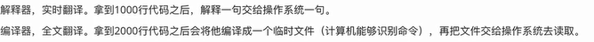
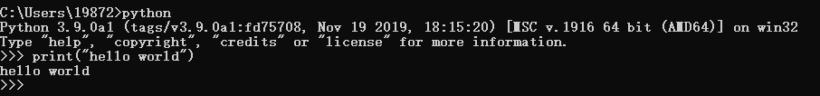
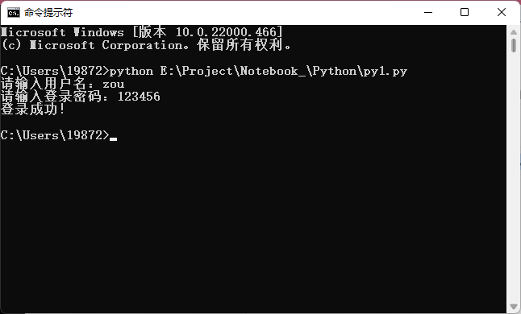
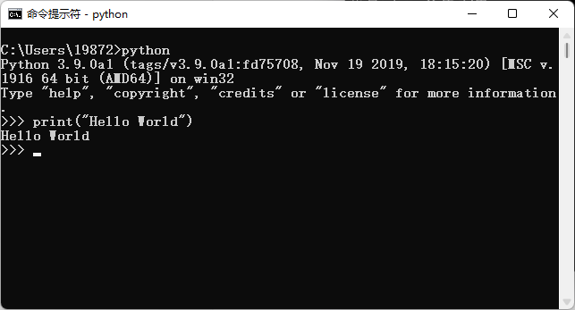
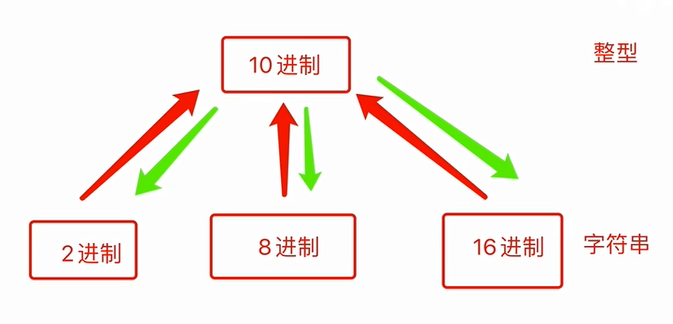

# Python学习笔记
[官网:www.python.org](www.python.org)
## 特性：

>- `解释型`、面向对象的语言、可移植性和跨平台
>- 性能较低、语法简洁
>- 应用范围：科学计算、人工智能、大数据、云计算...

Python的解释器：`CPython[主流]`、Jython...
解释器的版本：2.x 3.x
*从Python3开始学习*


>编译型语言：`Python、PHP、JavaScript、Ruby...`
>解释型语言：`C、C++、Go、Java...`

IDE集成开发环境：IDLE、PyCharm

>操作系统：
>- linux：centos、ubuntu、redhat等
>- mac：Catalina、Mojave、Sierra等

## 第一行代码


## 基础
### Python的编码
Python解释器默认编码：`utf-8`
```python
## 文本顶部修改更改编码
# -*- coding:编码 -*-

# Python相关的编码：
字符串（str）    "你好，世界"    unicode处理    一般在内存
字节（byte）    b"wofaniu..."    utf-8编码 or gbk编码    一般用于文件或网络

# 压缩成字节存储到文件中，用utf-8编码模式
data = "我".encode("utf-8")
print(data)
# b'\xe6\x88\x91'
# e6 88 91

# 将字节转换回字符串
data1 = data.decode("utf-8")
print(data1)
# 我

# ord获取单个字符的Unicode码
# ord("我")获取unicode的十进制表示
```
### 输入语句和输出语句
关键字：`input、print`
```python
# 用户输入的任何内容本质上都是字符串
name = input("请输入用户名：")
# 会自动换行
print("Hello World")
```
### 注释
关键字：`#、"""`
~~~python
# 我是注释
"""
我是多行注释
我是多行注释
我是多行注释
"""
# print会自动在末尾加换行符
print("Hello World")

# 不加换行符
print("Hello World",end="")
~~~
### 数据类型
关键字：`int（整型）、bool（布尔）、str（字符）、list（列表）、tuple（元组）、dict（字典）、set（集合）、float（浮点）`
- 可变类型:列表(内部元素可修改)
- 不可变类型:字符串 、布尔 、整型
#### 整型（int）
关键字：`bit_length()`
- py2：整型、长整型long （超出int范围自动转换long）
- py3：整型(无限制)

~~~python
# 获取二进制有多少个位组成(字节长度)
t1 = 8
result1 = t1.bit_length()
print(result1)    # 4

t2 = 9/2
print(t2)    # 4.5
~~~

#### 字符串（str）
##### 静态方法
关键字：`startswith()、endswith()、isdecimal()、strip()、upper()、lower()、replace()、split()、format()、center()、zfill()`
> 字符串内部元素不可被修改

```python
# 判断字符串是否以XX开头或以XX结尾，返回布尔值
# startswith() 、endswith() 语法
"str".startswith("st")
"str"endswith("r")


# 判断是否是十进制数，返回布尔值
# isdecimal()【推】 、isdigit() 语法
"str".isdecimal()


# 去除字符串两边的 空格、换行符、制表符，返回一个新字符串
# strip() 、lstrip()除左边 、rstrip()除右边
"  str ".strip()
"str".strip("r")    # 去除两边的r
## 应用：验证码判断


# 字符串变大写、小写，返回新字符串
# upper()、lower()
## 应用：验证码判断


# 字符串替换，返回新字符串
# replace()
"str".replace("oldStr","newStr")


# 字符串切割，返回一个列表
# spilt() 、rsplit() 从右向左切割
"str1|str2|str3".spilt("|")
"str1|str2|str3".spilt("|",1)    # 切割一次
## 应用：找文件后缀名


# 字符串拼接，返回新字符串
# join()
"拼接字符".join(List)    # 将列表的内容拼接成字符串


# 将字符串内容居中、居右、居左，返回新字符串
# center()、ljust()、rjust()
"str".center(填充数量,"填充物")


# 填充0，返回新字符串
# zfill()
"str".zfill(限定长度，不足补0)
## 应用：处理二进制数

```

~~~python
# 单行显示
print("Hello World")
print('Hello World')
# 多行显示
print("""我是第一行
我是第二行
我是第三行
""")
print('''我是第一行
我是第二行
我是第三行
''')

print('Hello Wo "r" ld')

# 拼接字符串
print("Hello" + "World")
# 字符串重复出现,并拼接
print(3 * "我是笨蛋")
~~~

##### 方法
关键字：`len()`
```python
# 获取长度
data = "str字符串"
len = len(data)
print(len)
# 获取字符串中的字符，索引
print(data[0]+data[1]+data[3])
print(data[-1]+data[-2]+data[-3])

# 获取字符串中的子字符串，切片
data[开始序列:取的数量]
data = "str字符串"
print(data[0:2])    # 从0开始取两个    st
print(data[0:])    # 从0开始，取到底    str字符串
print(data[:2])    # 从0开始，取两个    st
print(data[1:-1])    # 从1开始，取到倒数第一个    tr字符

# 跳着取字符串，步长
data[开始:结束:取的间隔（步长）]
data = "str字符串"
print(data[0:5:1])    # str字符
print(data[0:5:2])    # sr符

print(data[len(data):1:-1])    # 串符字r
print(data[-1:1:-2])    # 串字
print(data[::-1])    # 串符字rts

```
#### 布尔类型（bool）
~~~python
# 输出False
print(1 > 2)
print(2 > 1)
print(1 == "tom")
~~~

#### 列表（list）
关键字:`append，extend，insert，remove，clear，index，sort`
>有序可修改的,可存放不同元素类型的容器
>索引：0，1，2，3，4...oo

```python
# 定义
data_list = ["zou","data",123]
print(data_list)    # ["zou","data",123]

# 单个元素追加
list.append(元素)

# 批量元素追加
list1.extend(list2)    # 将列表2追加到列表1里
list1.extend([1,2,3,4])

# 指定位置插入
list.insert(位置,元素)

# 根据值删除
list.remove(元素)

# 根据索引删除
list.pop(元素所在序号)
list.pop()    # 默认最后一个值

# 清空列表
list.clear()

# 根据值获取索引位置（找不到元素，会报错）
list.index(元素)

# 列表排序
list.sort()    # 从小到大排序
list.sort(reverse=True)    # 从大到小排序
## sort的排序的原理：根据unicode的码表排序
## 字符串排序，比较第一个不相等的unicode码的大小，进行排序

### list中的 字符串 和 整数不能比较(报错)

# 反转列表
list.reverse()

```

```python
# 相加
data = [1,2,3,4] + [5,6,7,8,9]    # [1,2,3,4,5,6,7,8,9] 

# 相乘
data = ["你好","世界"] * 2    # ["你好","世界","你好","世界"]
```
#### 元组（tuple）有序不可修改的容器

### 相互转换
关键字：`int 、str 、bool`
~~~python
# 其他所有类型转换成 bool类型，除了空字符串、整数0、空列表、空元组、空字典 以外 都是True
bool("") False
bool(" ") True
str()
int()
bool()
~~~

### 变量和变量名
变量名规范：
- 由`字母、数字、下划线`组成
- 不能以`数字`开头
- 不能用Python内置`关键字`
~~~python
# 给值取变量名(给变量赋值)
name = "ZOU"
age = 20
print("姓名：" + name)
print(age)
~~~

### 条件语句
关键字：`if、elif、else`
```python
# 单条件判断语法
if 条件 :
    执行代码
else：
    执行代码


# 多条件判断语句
if 条件A:
    执行代码
elif 条件B：
    执行代码
elif 条件C:
    执行语句
else:
    执行语句


# 条件嵌套
if 条件A:
    if 条件A1:
        执行语句
    else:
        执行语句
elif 条件B:
    ...


# 统一缩进（四个空格或者Tab键）否则报错
username = input(请输入用户名：)
password = input("请输入登录密码：")
if username == "zou" and password == "123456":
    print("登录成功！")
else：
    print("登录失败！")
#一级代码，不在else里面
print("结束")

data = input("请输入一个整型：")
if int(data) % 2 == 1:
    print(data + "为偶数")
else：
    print(data + "为奇数")
```

### 循环语句 
关键词：`while、while else、break、continue、for in、range`
#### while循环（无限制循环）
```ptython
# 语法
while 条件:
    ...
    ...
    ...

# 条件不成立执行else
whle 条件
    ...
    break # 跳出整个循环，不执行else
else:
    ...
```
#### for循环（已知数量的循环）
```python
# 相当于Java中的forach
data = "你来打我呀"
for char in data:
    print(char)
# 你
# 来
# 打
# 我
# 呀
```
#### range
```python
# 创建一串有序的数字，返回列表
range(开始,结束,步长)
range(5)    # range(0, 5) [0,1,2,3,4]
data = "你来打我呀"
for i in range(len(data)):
    print(data[i])
```
### 字符串格式化
关键字：`%、format(推荐)、f(py3.6版本)`
#### %
```python
# 占位符%
name = "zou"
age = 20
text = "我叫%s" %name
text = "我叫%s，今年%d岁" %(name,age)
print(text)


# 可复用
text = "我叫%(name)s" %{"name":"邹"}
print(text)


text = "我叫%s"
data1 = text %("邹")
data2 = text %("zou")
print(text)

# 有占位符时，百分号%%

```
####  format
```python
#format
# 可命名,可复用
text1 = "我叫{0},今年{1}岁".format("邹",20)
text2 = "我叫{0},今年{1}岁,姓名为{0}".format("邹",20)
text3 = "我叫{name},今年{age}岁".format(name="邹",age=20)
print(text1)
print(text2)
print(text3)
# 我叫邹,今年20岁
# 我叫邹,今年20岁,姓名为邹
# 我叫邹,今年20岁


# 可复用模板
text = "我叫{0},今年{1}岁"
data1 = text.format("邹",20)
data2 = text.format("zou",18)
print(data1)
print(data2)
# 我叫邹,今年20岁
# 我叫zou,今年18岁

# 不能复用，默认{0}、{1}、{2}
text1 = "我叫{},今年{}岁".format("邹",20)
print(text1)

```
#### f
```python
name = "邹"
age = 20
text1 = f"我是{name},今年{age}岁"
print(text1)

# {}内可执行代码运算
text2 = f"我是邹,今年{20+1}岁"
print(text2)
# 我是邹,今年21岁

text3 = f"我是{'邹'},今年{20+1=}岁"
print(text3)
# 我是邹,今年20+1=21岁

# 进制转换
text4 = f"今年{20:#o}"
print(text4)
# 今年0o24
# 十进制转16进制
```

### 运算符
算数运算：`// 、** `
比较运算符：``!=(python3不支持`<>`的不等于) 、%= 、**= 、//=``
```python
# x//y 取返回商的整数
# x**y 返回x的y次幂
```
成语运算：`in 、not in`
```python
# 包不包含
text1 = "le" in "AAAA" # 返回True/False
```

逻辑运算:`and 、or 、not`
```python
# and
text = "zou" and "18"
# 转换成布尔值：True and True
# text最终结果取决于最后一个为True的值
text1 = "" and "18"
# 转换成布尔值：False and True
# text最终结果取决于前面为False的值

# or的值
# 有一个为True就停止往后运算，该值为最终结果
# 有False就继续往后运算，直到有一个为True，该值为最终结果否则最终结果为最后一个为False的值


# 多个not、and和or, 先计算not，再计算and，最后计算or
text = not 0 or 4 and 3 or 7 or 9 and 6
# True or 3 or 7 or 9 and 6
# True or 3 or 7 or 6
# True or 7 or 6
# True or 6
# True
print(text)
```

#### 运算符优先级
- 算数优先级 大于 比较运算符
- 比较运算符 大于 逻辑运算符
- 逻辑运算符 not > and >or

从高到底：`加减乘除 >比较 >not and or`

### Python代码运行方式
- 脚本式

- 交互式（代码测试）
 
退出交互式环境： `exit()`

### Python中的各进制存在方式及转换
关键字:`bin、oct、hex`
>10进制（整型）
>2进制、8进制、16进制（字符串）


```python
# 十进制转二进制等
# 2进制bin

t1 = bin(19) # 0b10011 0b为二进制标识
# t1 = "0b10011"
print(t1)

# 8进制oct
t2 = oct(23) # 0o27
print(t2)

# 16进制hex
t3 = hex(29) # 0x1d
print(t3)
```
```python
# 二进制转十进制等
# base=2/8/16
i1 = int("0b10011",base=2)
```
### 计算机中的单位
关键字：`b(bit)、B(byte)、KB(kilobyte)、、、`
- b（bit），位
```
1 ，1位
10 ，2位
101 ，3位
1001 ，4位
```
- B（byte）, 字节
```
8位是一个字节
1001 0110 ，1个字节
1001 0110 1001 0110 ，2个字节
```
- KB（kilobyte），千字节
```
1024个字节=1个千字节
1KB = 1024B = 1024*8 b
```
- M（Megabyte），兆
```
1024KB = 1M
```
- G（Gigabyte），千兆
```
1024M = 1G
```
- T（Terbyte），万亿字节
```
1024G = 1T
```
### 编码
关键字：`ascii 、gbk 、unicode 、utf8`
>将各种人类语言文字翻译成计算机语言（二进制）
#### ascii（包含字母和特殊字符）
```
一个字节来表示字母与二进制的对应关系
1KB = 8位
1001100110011001 8位
2**8 = 256种可能性
```
#### gbk（包含中日韩等文字）
> GB-2312国家信息标准委员会制作（1980年）
>GBK编码，对GB-2312的扩展，包含中日韩等文字（1995年）
>- 汉字2个字节
- 单字节表示，用一个字节表示对应的关系。（兼容ASCII码）
- 双字节表示，用两个字节表示对应的关系。2**16 = 65536种可能性

#### unicode（万国码包含表情）
[Unicode官网](https://unicode.org/)
##### 两种标准
- Ucs2
```
用固定的2个字节表示一个文字
00000000 00000000
```
- Ucs4
```
用固定的4个字节表示一个文字
00000000 00000000 00000000 00000000
2**32 = 4294967296种可能
```
缺点：浪费空间
unicode的应用：在文件存储和网络传输时，不会直接使用unicode，在内存中会用unicode。
#### utf-8(应用最广泛)
是对unicode的压缩，用尽量少的二进制去与文字进行对应
- 汉字3个字节
##### 压缩流程：
- 1.选用模板
```file:///E:/Project/Notebook_/Git/git使用总结.md
Unicode符号范围     |        UTF-8编码方式
(十六进制)          |              （二进制）
----------------------+----------------------------------
0000 0000-0000 007F | 0xxxxxxx
0000 0080-0000 07FF | 110xxxxx 10xxxxxx
0000 0800-0000 FFFF | 1110xxxx 10xxxxxx 10xxxxxx
0001 0000-0010 FFFF | 11110xxx 10xxxxxx 10xxxxxx 10xxxxxx
```
- 2.在模板中填入数据
```
"B" -> unicode码：0042 -> utf-8模板：0xxxxxxx
对应的二进制：1000010
填入模板：01000010
```
utf-8的应用：在文件存储和网络传输时，可将unicode转换为utf-8进行存储与传输。
